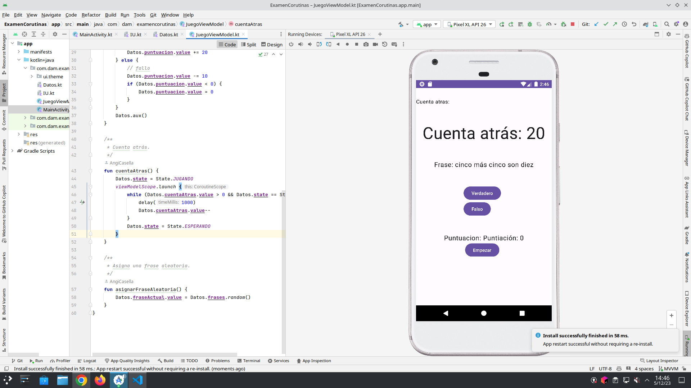

# README - MVVM en JuegoViewModel

## Descripción General

Este código implementa el patrón de arquitectura MVVM (Model-View-ViewModel) en el contexto de un juego simple. El juego cuenta con una cuenta regresiva, frases aleatorias, y botones de respuesta verdadero/falso. La lógica del juego y los datos están encapsulados en un ViewModel llamado `JuegoViewModel`. La interfaz de usuario (UI) se define en la función `IU`` utilizando Jetpack Compose.

## Componentes Principales

### MainActivity
En la actividad principal, se crea una instancia de **JuegoViewModel** y se establece como contenido principal de la actividad. La interfaz de usuario se compone principalmente de un conjunto de funciones Compose que se encargan de diferentes aspectos de la interfaz.

### Datos
Una clase objeto que almacena los datos del juego, como el estado actual, la cuenta regresiva, la puntuación y la lista de frases. También incluye una función **aux** para inicializar y cargar frases en la lista.

### State
Un enumerado que define los posibles estados del juego, como **JUGANDO** y **ESPERANDO**.

### IU
La función principal que compone la interfaz de usuario utilizando Compose. Se utiliza el **JuegoViewModel** para interactuar con la lógica del juego.

### JuegoViewModel
La clase ViewModel que gestiona la lógica del juego y la comunicación entre la interfaz de usuario y los datos del juego.

## Flujo del Juego
1. **Inicialización del Juego (`inicializarJuego``)**: Inicia el juego estableciendo el estado inicial, reiniciando la cuenta regresiva y la puntuación, y cargando frases.

2. **Comprobación de Frases (`comprobarFrase`)**: Verifica si la respuesta dada por el usuario es correcta y actualiza la puntuación en consecuencia.

3. **Cuenta Regresiva (`cuentaAtras`)**: Inicia una cuenta regresiva utilizando coroutines. La cuenta regresiva se actualiza cada segundo hasta que alcanza cero o hasta que el estado del juego cambie a **ESPERANDO**.

4. **Asignación de Frase Aleatoria (`asignarFraseAleatoria`)**: Asigna una nueva frase aleatoria para que el usuario responda.

## Interfaz de Usuario (Compose)
1. **Botón Empezar (`botonEmpezar`)**: Permite al usuario empezar la cuenta regresiva si el juego está en estado de espera.

2. **Cuenta Atrás (`cuentaAtras`)**: Muestra la cuenta regresiva actualizada en tiempo real.

3. **Frase (`frase`)**: Muestra la frase actual que el usuario debe evaluar como verdadera o falsa.

4. **Botones Verdadero/Falso (`botonesFalsoVerdadero`)**: Botones que permiten al usuario responder a la frase actual.

5. **Puntuación (`puntuacion`)**: Muestra la puntuación actual del usuario.

## Uso de Coroutines
Se utiliza el viewModelScope para lanzar coroutines en el JuegoViewModel. La cuenta regresiva utiliza una coroutine para actualizar la cuenta atrás cada segundo.

## Captura de pantalla:
